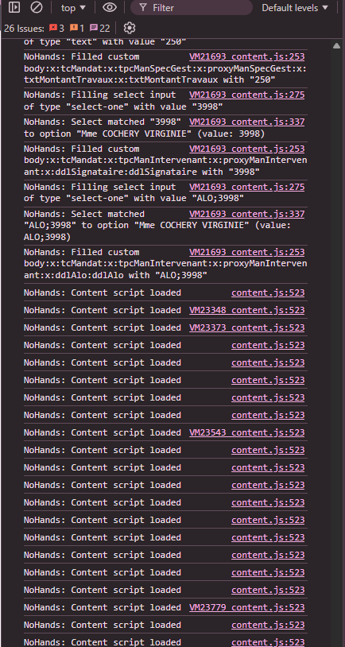
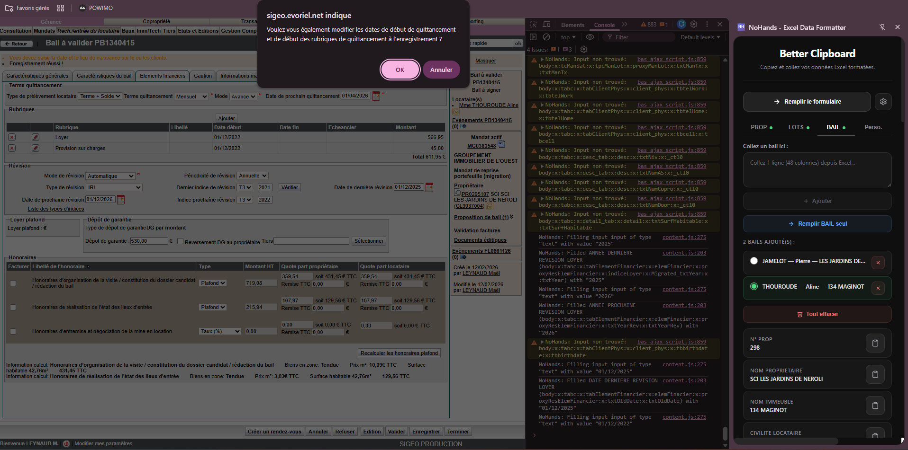

# 🐞 Bugs à corriger

## 1. Lenteurs et multiples "Content script loaded"

- Présence d’un grand nombre de messages **"Content script loaded"**.
- Fortes lenteurs lors du clic sur **"Remplir le formulaire"** .
- Le script doit fonctionner correctement dans les fenêtres de type :  
  `http://sigeo.evoriel.net/popup.aspx/fr/sig_cli/client_manage/ger/cli/`

---

## 2. Popup inattendue lors du remplissage

- Une popup apparaît lorsque je clique sur **"Remplir le formulaire"**, notamment pour :
  - La date de dernière révision
  - Le dernier indice de révision  
- Ce comportement ne doit pas se produire .

---

## 3. Condition trop restrictive du bouton "Remplir le formulaire"

- Le bouton doit être cliquable même si `prop`, `lots` ou `bail` n’ont pas de mapping.
- Tant qu’il existe des données dans **Perso**, **Prop**, **Lots** ou **Bail**, le bouton doit être actif.

---

## 4. Mauvaise valeur appliquée avec plusieurs LOTS

- Lorsqu’il y a plusieurs **LOTS** :
  - Je change de lot (swap).
  - Je clique sur **"Remplir le formulaire"**.
- Le champ **"SURFACE DU LOT"** ne reçoit pas la bonne valeur.
- C’est toujours la valeur d’un autre lot qui est appliquée.
- Il faut corriger l’association des données avec le lot actuellement sélectionné.

---

# ✨ Features à ajouter

## 1. Import / Export des champs personnalisés
- Ajouter une option pour importer et exporter les champs personnalisés (format JSON recommandé).

## 2. Position du bouton d’ajout
- Déplacer le bouton **"Ajouter un champ personnalisé"** sous la liste des champs déjà créés.

## 3. Bouton "Retour en haut"
- Ajouter un bouton permettant de revenir en haut lorsque la liste devient longue.
